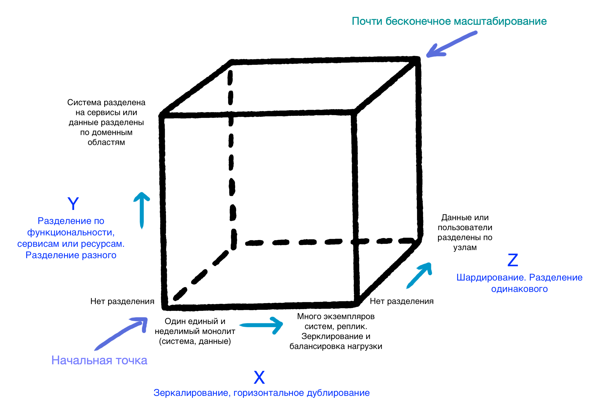

[Оглавление](../README.md)

# Принципы, паттерны, практики и подходы разработки ПО

- [SOLID.](#solid)
- [Паттерны. Какие знаете? Каких видов бывают? Расскажите парочку (желательно разных видов)? Какие применяли на практике или встречались где-то? Чем декоратор отличается от прокси, а абстрактная фабрика от обычной?](#паттерны-какие-знаете-каких-видов-бывают-расскажите-парочку-желательно-разных-видов-какие-применяли-на-практике-или-встречались-где-то-чем-декоратор-отличается-от-прокси-а-абстрактная-фабрика-от-обычной)
- [Что такое coupling и cohesion? Что из них (или оба) должно быть сильным (высоким) и/или слабым (низким)?](#что-такое-coupling-и-cohesion-что-из-них-или-оба-должно-быть-сильным-высоким-иили-слабым-низким)
- [Что такое куб масштабирования?](#что-такое-куб-масштабирования)
- [Расскажите о CAP-теореме. Как MongoDB (например) удовлетворяет CAP-теореме?](#расскажите-о-cap-теореме-как-mongodb-например-удовлетворяет-cap-теореме)
- [Чем композиция отличается от агрегации?](#чем-композиция-отличается-от-агрегации)
- [Какие бывают тестовые объекты (заглушки)? Чем стаб отличается от мока?](#какие-бывают-тестовые-объекты-заглушки-чем-стаб-отличается-от-мока)
- [Дайте определение полиморфизму](#дайте-определение-полиморфизму)
- [Что такое REST? Какое API является RESTful? Чем REST отличается от SOAP?](#что-такое-rest-какое-api-является-restful-чем-rest-отличается-от-soap)

## SOLID. 

Обычно просто просят расшифровать, что каждая буква означает с минимальным пояснением. Никто из моих интервьюеров не стал размусоливать или обсуждать. Один раз спросили, зачем оно вообще надо. Но, я думаю, чем больше сеньорности в вакансии, тем глубже и интереснее дискуссия может возникнуть.
   
   - *S* - Принцип единственной ответственности (The Single Responsibility Principle). Каждый класс должен иметь одну и только одну причину для изменений.
   - *O* - Принцип открытости/закрытости (The Open Closed Principle). Сущности должны быть открыты для расширения, но закрыты для модификации.
   - *L* - Принцип подстановки Барбары Лисков (The Liskov Substitution Principle). Объекты должны быть заменяемыми на экземпляры их подтипов без изменения правильности выполнения программы. Наследующий класс должен дополнять, а не изменять базовый.
   - *I* - Принцип разделения интерфейса (The Interface Segregation Principle). Много специальных интерфейсов лучше, чем один универсальный.
   - *D* - Принцип инверсии зависимостей (The Dependency Inversion Principle). Зависеть нужно от абстракций, а не от реализаций.

Первоисточником, сформулировавшим данные принципы стал дядюшка "Свет наш чистый код" [Боб Мартин](https://ru.wikipedia.org/wiki/%D0%9C%D0%B0%D1%80%D1%82%D0%B8%D0%BD,_%D0%A0%D0%BE%D0%B1%D0%B5%D1%80%D1%82_(%D0%B8%D0%BD%D0%B6%D0%B5%D0%BD%D0%B5%D1%80)), а акроним придумал один из его читателей. Хотите погрузиться глубже? Тогда читайте часть 3 его книги ["Чистая архитектура"](https://www.piter.com/product/chistaya-arhitektura-iskusstvo-razrabotki-programmnogo-obespecheniya). Книжка годная, читается легко, не пожалеете. Однако пропускайте всё через свой опыт и оценивайте критически, мало ли что :)

Сама по себе тема богатая и холиворная, ибо многие начинают трактовать эти принципы по-своему. На этой почве может случиться недопонимание с собеседующим, будьте аккуратны и конструктивны. Достаточно [поискать статьи на Хабре](https://habr.com/ru/search/?q=SOLID#h) по SOLID или каким-нибудь принципам в отдельности и заглянуть в комментарии. Кому-то SOLID вообще не по душе.

Также, могу посоветовать, самостоятельно разобрать каждый принцип на практическом примере, ибо за это тоже могут спросить. Или заглянуть на [Baeldung](https://www.baeldung.com/solid-principles).

[к содержанию](#принципы-паттерны-практики-и-подходы-разработки-по)

## Паттерны. Какие знаете? Каких видов бывают? Расскажите парочку (желательно разных видов)? Какие применяли на практике или встречались где-то? Чем декоратор отличается от прокси, а абстрактная фабрика от обычной?

Обычно советуют и в вакансиях пишут про [книжку GoF](https://www.ozon.ru/context/detail/id/2457392/). Но, на мой взгляд, сейчас есть вариант даже лучше - [refactoring.guru](https://refactoring.guru/ru/design-patterns). Там и сравнение, и на родной мове (русский, украинский, английский, китайский), и примеры на вашем любимом ЯП, прекрасные иллюстрации и диаграммы. Там также можно купить книжку по паттернам. Автору большой-большой респект.

[к содержанию](#принципы-паттерны-практики-и-подходы-разработки-по)

## Что такое coupling и cohesion? Что из них (или оба) должно быть сильным (высоким) и/или слабым (низким)?

[Coupling](https://ru.wikipedia.org/wiki/%D0%97%D0%B0%D1%86%D0%B5%D0%BF%D0%BB%D0%B5%D0%BD%D0%B8%D0%B5_(%D0%BF%D1%80%D0%BE%D0%B3%D1%80%D0%B0%D0%BC%D0%BC%D0%B8%D1%80%D0%BE%D0%B2%D0%B0%D0%BD%D0%B8%D0%B5)) (Зацепление) - степень зависимости между программными компонентами. Должна быть *низкой*.

[Cohesion](https://ru.wikipedia.org/wiki/%D0%A1%D0%B2%D1%8F%D0%B7%D0%BD%D0%BE%D1%81%D1%82%D1%8C_(%D0%BF%D1%80%D0%BE%D0%B3%D1%80%D0%B0%D0%BC%D0%BC%D0%B8%D1%80%D0%BE%D0%B2%D0%B0%D0%BD%D0%B8%D0%B5)) (Связность) - степень сфокусированности методов класса. Должна быть *высокой*.

Подробнее почитать и посмотреть картинки можно [тут](https://thebojan.ninja/2015/04/08/high-cohesion-loose-coupling/) на английском или [тут](https://medium.com/german-gorelkin/low-coupling-high-cohesion-d36369fb1be9) на русском.

Тема периодически затрагивается на Хабре в контексте построения хорошей архитектуры и написания качественного кода. Как и всегда, особую ценность составляют комментарии:
- [Создание архитектуры программы или как проектировать табуретку](https://habr.com/ru/post/276593/)
- [Принцип единственной ответственности: глубокое погружение](https://habr.com/ru/post/465507/). Есть раздел, где тема разобрана с примерами кода.
- [Утрата слабой связанности](https://habr.com/ru/post/206684/)

Также coupling и cohesion часто упоминаются или ведут к обсуждению [GRASP](https://ru.wikipedia.org/wiki/GRASP). Об этом можно почитать на Хабре: [раз](https://habr.com/ru/post/38323/) и [два](https://habr.com/ru/post/92570/).

[к содержанию](#принципы-паттерны-практики-и-подходы-разработки-по)

## Что такое куб масштабирования?

Куб масштабирования (scale cube, из книги [The Art of Scalability](https://www.oreilly.com/library/view/the-art-of/9780134031408/)) является наглядным изображением трёх ортогональных способов увеличения производительности приложения: sharding, mirrorring и microservices.

- [Sharding](https://en.wikipedia.org/wiki/Shard_(database_architecture)) (data partioning) - разбиение и размещение однотипных данных по разным узлам.
- [Mirroring](https://www.techopedia.com/definition/30664/database-mirroring) (horizontal duplication) - дублирование или клонирование данных для уменьшения времени отклика.
- [Microservices](https://microservices.io/) - архитекутрный подход, при котором функциональность системы разбивается на отдельные сервисы по бизнес-задачам.

Наглядно:

Почитать подробнее:
- Упоминание в [статье](https://habr.com/ru/company/dataart/blog/280083/) на Хабре.
- В [статье](https://microservices.io/articles/scalecube.html) на microservices.io.
- Даже в [wiki](https://en.wikipedia.org/wiki/Scale_cube) есть с pros и cons.
- [SCALING APPLICATIONS : THE SCALE CUBE](https://geeknarrator.com/2018/03/06/scaling-applications-the-scale-cube/).
- И вот [ещё](https://www.instana.com/blog/scaling-microservices-advanced-approaches-with-the-akf-scaling-cube/).
- А [тут](https://akfpartners.com/growth-blog/scale-cube) с картинками.
- Также куб упоминается в книгах [Microservice Patterns and Best Practices](https://www.packtpub.com/application-development/microservice-patterns-and-best-practices) и [Microservices Patterns](https://www.manning.com/books/microservices-patterns) (есть на русском).

[к содержанию](#принципы-паттерны-практики-и-подходы-разработки-по)

## Расскажите о CAP-теореме. Как MongoDB (например) удовлетворяет CAP-теореме?

[Теорема CAP](https://en.wikipedia.org/wiki/CAP_theorem) - эвристическая теорема, утверждающая, что любая распределённая система может удовлетворять не более двум из трёх свойств:
- [Consistency](https://en.wikipedia.org/wiki/Consistency_model) (согласованность) - во всех вычислительных узлах в один момент времени данные не противоречат друг другу - каждое чтение вернёт самую последнюю запись. Подразумевает под собой [линеаризуемость](http://cs.brown.edu/~mph/HerlihyW90/p463-herlihy.pdf) - если произошла какая-либо операция, то её результат доступен сразу после того, как был получен ответ о её выполнении.
- [Availability](https://en.wikipedia.org/wiki/Availability) (доступность) - любой запрос получает успешный ответ без гарантии, что ответы со всех узлов системы совпадают.
- [Partition tolerance](https://en.wikipedia.org/wiki/Network_partition) (устойчивость к разделению) - система продолжает функционировать, несмотря на потерю (или задержку) произвольного числа сообщений между узлами из-за сетевых проблем (асинхронная сеть).

MongoDB, по мнению большинства ([например](https://www.ibm.com/cloud/learn/cap-theorem)), это - CP, но вот есть [статья](https://habr.com/ru/post/258145/)... Держим в уме, что теорема эвристическая и носит упрощательный характер. Также вызывает много споров.

Про большинство БД можно найти ответы в статьях по дополнительным ссылкам ниже.

Подробности:
- Есть несколько статей на Хабре: [раз](https://habr.com/ru/post/328792/), [два](https://habr.com/ru/post/130577/), [три](https://habr.com/ru/post/258145/), [четыре](https://habr.com/ru/post/231703/), [пять](https://habr.com/ru/post/322276/)
- [Visual Guide to NoSQL Systems](https://blog.nahurst.com/visual-guide-to-nosql-systems) с красивой иллюстрацией треугольника CAP и БД на его сторонах
- [The CAP FAQ](https://www.the-paper-trail.org/page/cap-faq/)
- [Статья](https://www.bigdataschool.ru/wiki/cap) на bigdataschool
- [Споры](https://stackoverflow.com/questions/11292215/where-does-mongodb-stand-in-the-cap-theorem) вокруг MongoDB на stackoverflow
- [CAP Theorem](https://www.ibm.com/cloud/learn/cap-theorem) на портале IBM
- [CAP Theorem and Distributed Database Management Systems](https://towardsdatascience.com/cap-theorem-and-distributed-database-management-systems-5c2be977950e) с картинками
- [What is the CAP Theorem?](https://medium.com/@bikas.katwal10/mongodb-vs-cassandra-vs-rdbms-where-do-they-stand-in-the-cap-theorem-1bae779a7a15) на богомерзком medium

[к содержанию](#принципы-паттерны-практики-и-подходы-разработки-по)

## Чем композиция отличается от агрегации?

Композиция (composition) - отношение "является частью" (HAS-A Relationship), при котором целое явно контролирует время жизни своей составной части.

Агрегация (aggregation) - отношение "является частью" (HAS-A Relationship), при котором целое хоть и содержит свою составную часть, время их жизни не связано.

Подробнее:
- [Наследование vs Композиция vs Агрегация](http://sergeyteplyakov.blogspot.com/2012/12/vs-vs.html#:~:text=%D0%A0%D0%B0%D0%B7%D0%BD%D0%B8%D1%86%D0%B0%20%D0%BC%D0%B5%D0%B6%D0%B4%D1%83%20%D0%BA%D0%BE%D0%BC%D0%BF%D0%BE%D0%B7%D0%B8%D1%86%D0%B8%D0%B5%D0%B9%20%D0%B8%20%D0%B0%D0%B3%D1%80%D0%B5%D0%B3%D0%B0%D1%86%D0%B8%D0%B5%D0%B9,%D1%81%D0%BE%D1%81%D1%82%D0%B0%D0%B2%D0%BD%D0%B0%D1%8F%20%D1%87%D0%B0%D1%81%D1%82%D1%8C%20%D0%BF%D0%B5%D1%80%D0%B5%D0%B4%D0%B0%D0%B5%D1%82%D1%81%D1%8F%20%D1%87%D0%B5%D1%80%D0%B5%D0%B7%20%D0%BF%D0%B0%D1%80%D0%B0%D0%BC%D0%B5%D1%82%D1%80%D1%8B)
- [Наследование, композиция, агрегация](https://habr.com/ru/post/354046/)
- [Агрегация и композиция](https://ru.stackoverflow.com/questions/596697/%D0%90%D0%B3%D1%80%D0%B5%D0%B3%D0%B0%D1%86%D0%B8%D1%8F-%D0%B8-%D0%BA%D0%BE%D0%BC%D0%BF%D0%BE%D0%B7%D0%B8%D1%86%D0%B8%D1%8F)

[к содержанию](#принципы-паттерны-практики-и-подходы-разработки-по)

## Какие бывают тестовые объекты (заглушки)? Чем стаб отличается от мока?

Тестовый объект (Test Double) - объекты, которые необходимы в тестах для подмены внешних зависимостей тестируемого кода
Типы тестовых объектов:
- **Dummy** - объекты, которые передаются в методы, но не используются. Например: заполнение списка параметров, часто это просто null
- **Fake** - заглушка, являющаяся рабочей имплементацией, но с урезанной функциональностью и неприменима в production-окружении. Например: in-memory БД (fake database)
- **Stub** - заглушка с жестко заданными ответами на вызовы со стороны тестируемого объекта (system under test - SUT) во время теста
- **Spy** - это разновидность Stub, которая записывает информацию о произошедшем с ней, какие вызовы её методов были выполнены и сколько раз, как изменилось состояние и т.п.
- **Mock** - заглушка с ожиданиями определённого набора вызовов, которые будут на ней выполнены в ходе теста

Из данного набора заглушек только Mock используется для верификации поведения, остальные - для верификации состояния тестируемого объекта .

Подробнее:
- В [статье](https://habr.com/ru/post/116372/) на Хабре
- [Mock vs Stub](https://www.maxshulga.ru/2012/03/mock-vs-stub.html)
- [Mocks Aren't Stubs](https://www.martinfowler.com/articles/mocksArentStubs.html) от Мартина Фаулера
- [Test Double](http://xunitpatterns.com/Test%20Double.html)
- [Test Stub](http://xunitpatterns.com/Test%20Stub.html)
- [Test Spy](http://xunitpatterns.com/Test%20Spy.html)
- [Mock Object](http://xunitpatterns.com/Mock%20Object.html)
- [Fake Object](http://xunitpatterns.com/Fake%20Object.html)
- [Interaction Based Testing](http://spockframework.org/spock/docs/##0/interaction_based_testing.html) в Spock Framework
- [Документация](https://javadoc.io/doc/org.mockito/mockito-core/latest/org/mockito/Mockito.html) Mockito
- [Mockito Mock vs. Spy in Spring Boot Tests](https://dzone.com/articles/mockito-mock-vs-spy-in-spring-boot-tests)
- [Tag: Mockito](https://www.baeldung.com/tag/mockito/) на Bealdung

[к содержанию](#принципы-паттерны-практики-и-подходы-разработки-по)

## Дайте определение полиморфизму

В общем виде определение [полиморфизма](https://en.wikipedia.org/wiki/Polymorphism_(computer_science)) приводит Бенджамин Пирс в своей книге [Типы в языках программирования](https://medium.com/devschacht/polymorphism-207d9f9cd78):
> Термин “полиморфизм” обозначает семейство различных механизмов, позволяющих использовать один и тот же участок программы с различными типами в различных контекстах.

Полиморфизм бывает следующих видов:
1. Универсальный полиморфизм. Он подразделяется на:
    - [Параметрический полиморфизм](https://ru.wikipedia.org/wiki/%D0%9F%D0%B0%D1%80%D0%B0%D0%BC%D0%B5%D1%82%D1%80%D0%B8%D1%87%D0%B5%D1%81%D0%BA%D0%B8%D0%B9_%D0%BF%D0%BE%D0%BB%D0%B8%D0%BC%D0%BE%D1%80%D1%84%D0%B8%D0%B7%D0%BC) - описывает вычисления в общем виде, абстрагируясь от конкретных типов, которые будут использованы. Параметрически полиморфные функции также называются обобщенными ([Generic](https://en.wikipedia.org/wiki/Generic_programming)).
    - Полиморфизм включений (inclusive) - описывает вычисления не только для конкретного типа, но для и всех его возможных подтипов. Отражает [принцип подстановки Барбары Лисков](https://en.wikipedia.org/wiki/Liskov_substitution_principle).
2. [Специальный полиморфизм](https://en.wikipedia.org/wiki/Ad_hoc_polymorphism) (или ad-hoc) - диспетчеризация (перенаправление) к одной или нескольким функциям для конкретного типа аргумента. Из него выделяют подтипы:
    - [Перегрузка](https://ru.wikipedia.org/wiki/%D0%9F%D0%B5%D1%80%D0%B5%D0%B3%D1%80%D1%83%D0%B7%D0%BA%D0%B0_%D0%BF%D1%80%D0%BE%D1%86%D0%B5%D0%B4%D1%83%D1%80_%D0%B8_%D1%84%D1%83%D0%BD%D0%BA%D1%86%D0%B8%D0%B9) (overloading) позволяет объявлять функции с одним и тем же именем, но с разными типами аргументов и их количеством (арностью).
    - Неявное [приведение типов](https://ru.wikipedia.org/wiki/%D0%9F%D1%80%D0%B8%D0%B2%D0%B5%D0%B4%D0%B5%D0%BD%D0%B8%D0%B5_%D1%82%D0%B8%D0%BF%D0%B0) - преобразование одного типа в другой по определённым правилам, описанным в стандарте языка, и выполняемое компилятором.

Безотносительно к Java полиморфизм хорошо разобран в статье [Полиморфизм простыми словами](https://medium.com/devschacht/polymorphism-207d9f9cd78).
В других источниках:
- [Java Challengers #3: Полиморфизм и наследование](https://habr.com/ru/company/otus/blog/429120/) на Хабре
- [Как полиморфизм реализован внутри JVM](https://habr.com/ru/company/otus/blog/467197/) на Хабре
- [Все о переопределении в Java](https://habr.com/ru/company/otus/blog/347900/) на Хабре
- [Неформальное введение в теорию типов](https://www.youtube.com/watch?v=RzzhKTiDSWQ)
- Несколько глав из Java Virtual Machine Specification: [Invoking Methods](https://docs.oracle.com/javase/specs/jvms/se14/html/jvms-3.html#jvms-3.7), [invokevirtual](https://docs.oracle.com/javase/specs/jvms/se14/html/jvms-6.html#jvms-6.5.invokevirtual), [Linking](https://docs.oracle.com/javase/specs/jvms/se14/html/jvms-5.html#jvms-5.4)
- Несколько глав из Java Language Specification: [Inheritance, Overriding, and Hiding](https://docs.oracle.com/javase/specs/jls/se14/html/jls-8.html#jls-8.4.8), [Conversions and Contexts](https://docs.oracle.com/javase/specs/jls/se14/html/jls-5.html), [Type Inference](https://docs.oracle.com/javase/specs/jls/se14/html/jls-18.html)

[к содержанию](#принципы-паттерны-практики-и-подходы-разработки-по)

## Что такое REST? Какое API является RESTful? Чем REST отличается от SOAP?

[REST](https://ru.wikipedia.org/wiki/REST) – это архитектурный стиль, который можно применить для реализации взаимодействия web-сервисов.
Вот несколько признаков REST, которые хотят услышать большинство интервьюеров:
- Концентрация на ресурсах
- Ресурс имеет уникальный URI
- Формат передачи - обычно JSON, но можно XML
- Транспортный протокол - HTTP. Строго говоря - это необязательно, но по факту и в большинстве случаев так. Следующие пункты тоже.
- Использование различных методов HTTP в соответствии с их семантикой и предназначением. GET: получить информацию о ресурсе; POST: создать новый ресурс; PUT: обновить существующий ресурс; DELETE: удалить ресурс. Иногда спорят об обновлении - PUT vs PATCH vs POST.
- Использование кодов ответа HTTP в соответствии с их семантикой и предназначением. Хорошая [картинка](https://raw.githubusercontent.com/wiki/webmachine/webmachine/images/http-headers-status-v3.png) по определению HTTP-кода ответа.
- [HATEOAS](https://habr.com/ru/post/483328/) обычно не используют и не спрашивают, но это тоже относится к REST, о чём можно упомянуть

Чаще всего, на моей практике, спрашивают какой HTTP-метод для чего должен использоваться или как назвать URI, чтобы API было RESTful. Однако никакой спецификации или стандарта под это нет. И вообще, строго говоря, изначально REST - это *архитектурный стиль*, непривязанный ни к каким протоколам. Тема раскрыта в [этой статье](https://habr.com/ru/post/319984/) или в [этой](https://habr.com/ru/company/hexlet/blog/274675/) на Хабре - комментарии сочные.

Вот принципы REST-архитектуры по Филдингу:
- Модель клиент-сервер (Client–server)
- Отсутствие состояния (Stateless) - у клиента и сервера нет необходимости отслеживать состояние друг друга
- Кэширование (Cacheable) - ответы сервера должны помечаться как кэшируемы и некэшируемые
- Единообразие интерфейса (Uniform interface) - идентификация ресурсов, манипуляция ресурсами через представление, "самодостаточные" сообщения, HATEOAS
- Слои (Layered system) - в системе может быть больше одного слоя, но компоненты системы видит и взаимодействует только с соседним слоем. Кроме клиента и сервера может быть ещё прокси и шлюз
- Код по требованию (необязательное ограничение) (Code on demand (optional)) - отправка сервером исполняемого кода клиенту

[SOAP](https://ru.wikipedia.org/wiki/SOAP) - стандартизованный протокол обмена данными.
Основные характеристики SOAP:
- Формат сообщений - XML (SOAP-XML - Envelope, Header, Body, Fault)
- SOAP-сервис должен иметь описание на языке [WSDL](https://ru.wikipedia.org/wiki/WSDL)(тоже XML)
- SOAP поддерживает множество протоколов - (TCP, UDP, HTTP, SMTP, FTP и т.д.)
- При использовании HTTP, поддерживаются методы GET и POST

Тема горячая, интересная всем web-разработчикам, поэтому на Хабре имеется уйма статей на любой вкус.

Теоритическо-практические:
- Серия постов про REST - [введение](https://habr.com/ru/post/483202/), [REST vs SOAP](https://habr.com/ru/post/483204/), [Contract First](https://habr.com/ru/post/483206/), [Code First](https://habr.com/ru/post/483322/), [HATEOAS](https://habr.com/ru/post/483328/), [Рекомендации и примеры на Java и Spring](https://habr.com/ru/post/483374/)
- [REST vs SOAP. Часть 1. Почувствуйте разницу](https://habr.com/ru/post/131343/) и [REST vs SOAP. Часть 2. Как проще и эффективнее организовать общение платформ?](https://habr.com/ru/post/134303/)
- [Дао Вебсервиса. (Или да хватит же изобретать велосипеды!)](https://habr.com/ru/post/75248/)
- [REST API Best Practices](https://habr.com/ru/post/351890/)
- [Что такое RESTful на самом деле](https://habr.com/ru/company/hexlet/blog/274675/)
- [Важные аспекты RESTful API для вашего проекта](https://habr.com/ru/post/108993/)
- [Как построить REST-like API в крупном проекте](https://habr.com/ru/company/yamoney/blog/347390/)
- [Разработка web API](https://habr.com/ru/post/181988/)
- [RESTful API для сервера – делаем правильно (Часть 1)](https://habr.com/ru/post/144011/) и [RESTful API для сервера – делаем правильно (Часть 2)](https://habr.com/ru/post/144259/)
- [Шпаргалки по безопасности: REST](https://habr.com/ru/company/acribia/blog/453384/)
- [7 вредных советов проектировщику REST API](https://habr.com/ru/post/325884/)
- [Самодокументированный JAX-WS с поддержкой XSD Restrictions](https://habr.com/ru/post/220387/)
- [REST API на Java без фреймворков](https://habr.com/ru/company/otus/blog/480564/)
- [Введение в Spring Boot: создание простого REST API на Java](https://habr.com/ru/post/435144/)
- [Наипростейший RESTful сервис на Kotlin и Spring boot](https://habr.com/ru/post/343364/)
- [SOAP-сервер на Java при участии Apache CXF и Spring](https://habr.com/ru/post/137543/)
- [SOAP Web-сервис средствами Spring-WS](https://habr.com/ru/post/148403/)

Холиварно-дискусионные:
- [REST — это новый SOAP](https://habr.com/ru/company/mailru/blog/345184/)
- [REST страсти по 200](https://habr.com/ru/post/440900/)
- [REST API должен основываться на гипертексте](https://habr.com/ru/post/483528/)
- [RESTful API — большая ложь](https://habr.com/ru/post/265845/)

И на всякий случай:
- [Сравнение REST и GraphQL](https://habr.com/ru/post/335158/)
- [REST? Возьмите тупой JSON-RPC](https://habr.com/ru/post/441854/)

А кроме Хабра:
- [A Brief Introduction to REST](https://www.infoq.com/articles/rest-introduction/)
- [REST CookBook](http://restcookbook.com/)
- [RESTful Web APIs](http://restfulwebapis.org/)
- [Introduction to Spring Data REST](https://www.baeldung.com/spring-data-rest-intro)
- [What is REST](https://restfulapi.net/)
- [Building REST services with Spring](https://spring.io/guides/tutorials/bookmarks/)
- [Создание SOAP Web-сервиса](https://spring-projects.ru/guides/producing-web-service/)
- [Спецификация SOAP](https://www.w3.org/TR/soap/)

[к содержанию](#принципы-паттерны-практики-и-подходы-разработки-по)